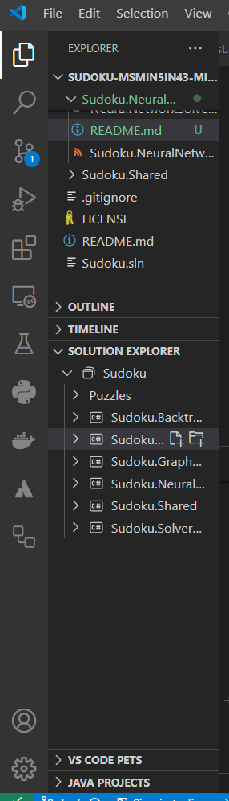
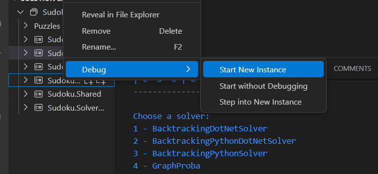
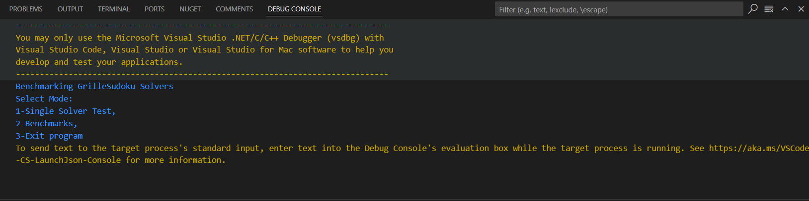

Click droit dans le solution explorer sur Sudoku.NeuralNetworkCSharp

Start new instance dans l'onglet debug

Single Solver Test (taper 1 dans la console)
Puis naviguer pour tester avec NeuralNetworkCSharp